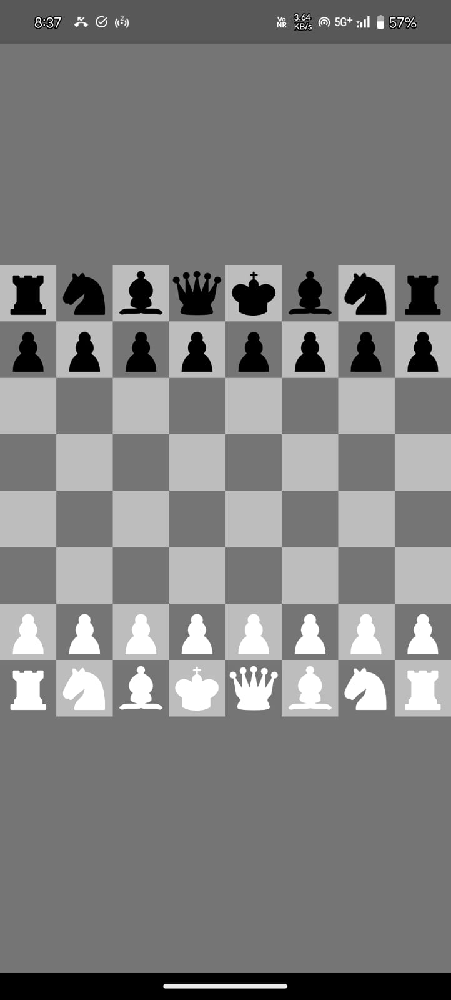
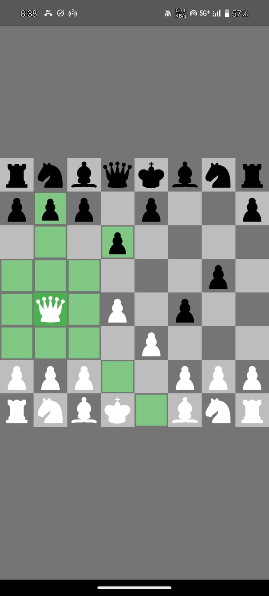
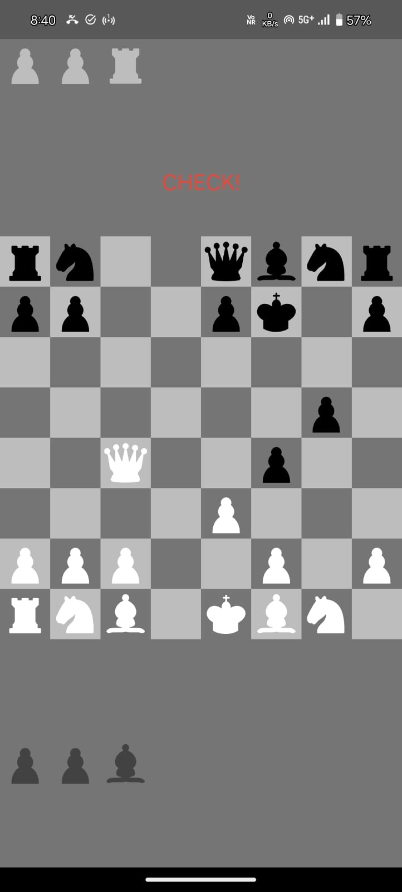

# Chess ♟️

A modern and interactive chess game built with Flutter.

 

## 📷 Screenshots

| 📱 Moves | Check |
|----------- |-----------|
|  |  |

## 🛠️ Installation

To get started with the Chess, follow these steps:

1. **Clone the repository**:
   ```bash
   git clone https://github.com/sandeshtukrul/chess.git
   ```
2. **Navigate to the project directory:**

   ```bash
   cd chess
   ```
3. **Install dependencies:**

   ```bash
   flutter pub get
   ```
4. **Run the application:**

   ```bash
   flutter run
   ```
## 🎮 How to Play

- Start a game use the intuitive controls to move your pieces and strategize your gameplay.


## 🤝 Contributing

We welcome contributions! If you'd like to contribute to the project, please follow these steps:

1. Fork the repository.
2. Create a new branch:

  ```
  git checkout -b feature/YourFeature
  ```


3. Make your changes and commit them:

```
git commit -m "Add some feature"
```

4. Push to the branch:
```
git push origin feature/YourFeature
```

5. Open a pull request.

## 📜 License

This project is licensed under the MIT License - see the [LICENSE](LICENSE) file for details.

## ⭐ Show Your Support
If you like this project, consider giving it a ⭐ on [GitHub](https://github.com/sandeshtukrul/chess)!

**Contact**

For any inquiries, please reach out to 
tukrulsandesh123@gmail.com.

---
Made with ❤️ by [Sandesh Tukrul](https://github.com/sandeshtukrul)
